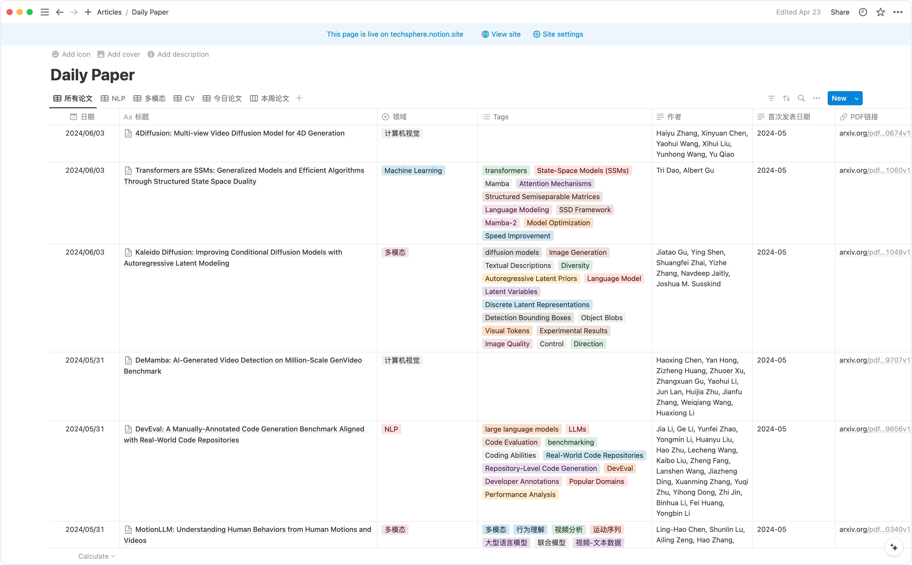
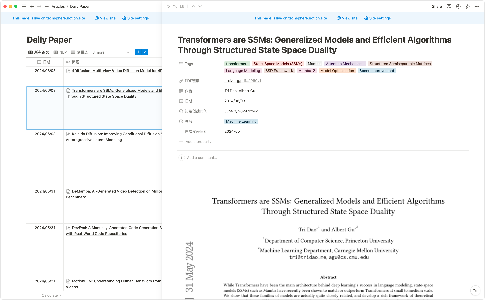

# 概述

本项目可以扫描HuggingFace的[Daily Papers](https://huggingface.co/papers)页面，解析页面，获取相关论文标题、截图、ID等，调用Arxiv库获取论文更完善的信息，调用LLM API（目前是调用的是Moonshot API）对摘要进行分析，首先翻译成中文，然后解析摘要中提到的论文的动机、方法、结果，并尝试对论文打标签，最后将解析结果，原始论文的链接，使用Notion API，发送到Notion。

最终的效果如下图所示：

论文主列表：



详情页：



# 快速上手

## 准备工作

- 申请Moonshot API：如果使用其他LLM的话，在`src/service/llm_service.py`中，替换为其他LLM的相关配置
- Notion配置（可选），这步不申请的话，后续过程论文可以正常获取、解析，但结果无法正常插入Notion
  - 在[此页面](https://www.notion.so/my-integrations)点击Create new integration，创建一个token，创建好之后，记录下Internal Integration Secret，供后续认证使用
  - 在要写入的页面，点击右上角的三个点，在弹出的菜单中，点击Connect to，选择刚才生成的Integration名称
  - 同样点击要写入的页面右上角的三个点，在弹出的菜单中，点击Copy link to view，可以得到类似 https://www.notion.so/techsphere/fed0d00cd41542aaadbaac18a092b8eb 的地址，其中的fed0d00cd41542aaadbaac18a092b8eb就是要拷贝的Notion DB ID
- Slack API申请（可选），这一步主要是配置定时调度后，将每次程序运行结果发送到Slack，如果不需要的话，这步置空或者随意填写一个字符串即可 

## 安装依赖

```bash
pip install requirements.txt
```


## 修改启动脚本

修改`bin/start_daily_paper_app.sh`中SLACK_API_KEY、KIMI_API_KEY、NOTION_SECRET、NOTION_DB_ID

如上所述，只有KIMI_API_KEY是必须的，其他的如果不需要可以随意输入其他字符串

## 启动程序

```bash
sh bin/start_daily_paper_app.sh
```
